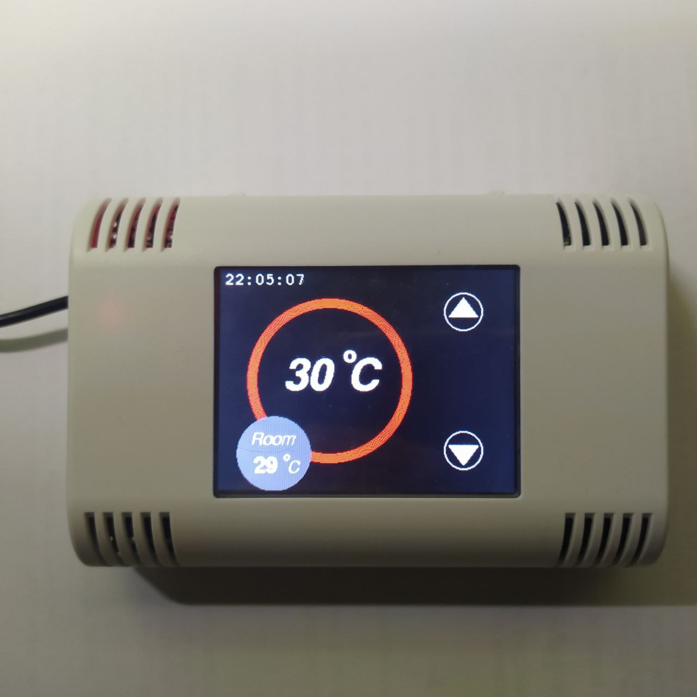
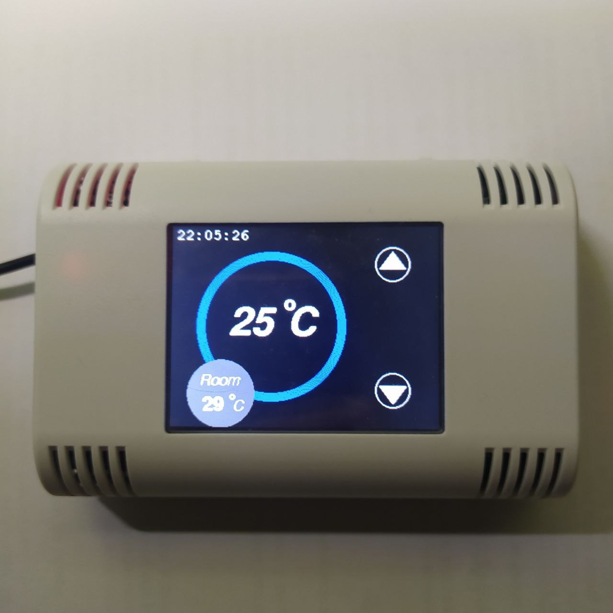
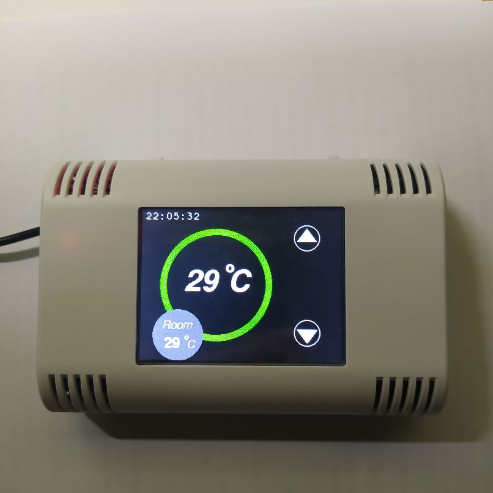

# **Thermostat** DIY (based on AZ-Touch Mod & ESP32 DEV Kit)

ESP32 based wall thermostat with ILI9341 touchscreen with telematic collection data through Thinger.io

## Hardware Components

- [Az-Touch](https://www.az-delivery.de/products/az-touch-wandgehauseset-mit-2-8-zoll-touchscreen-fur-esp8266-und-esp32)
- [ESP32 Dev Kit](https://www.espressif.com/en/products/devkits/esp32-devkitc)
- BME/BMP280 Sensor
- Relay Module 220/110v 10A

## Software

Project developed with Platform.io into VSCode
